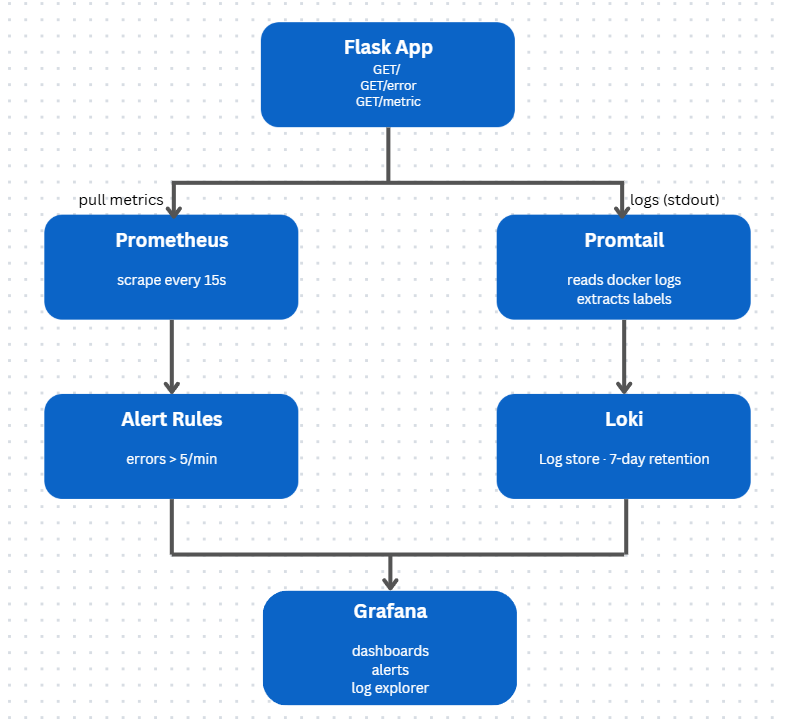
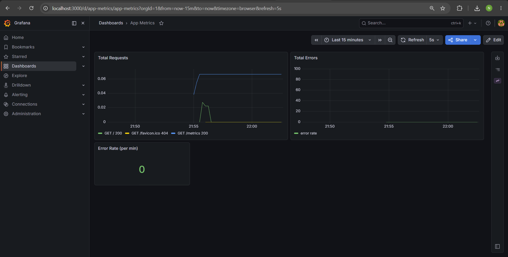
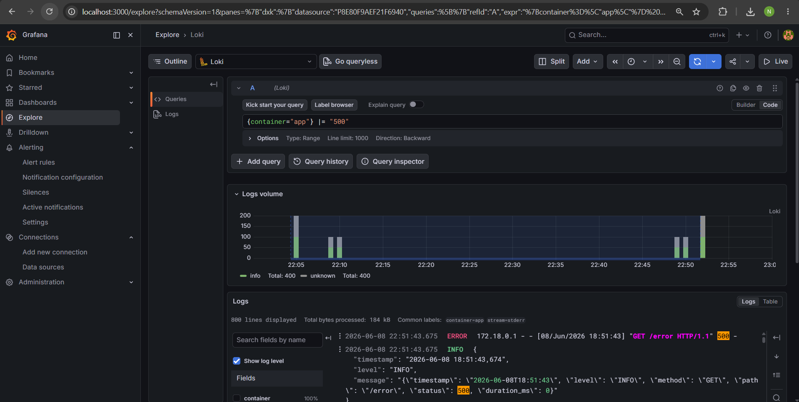
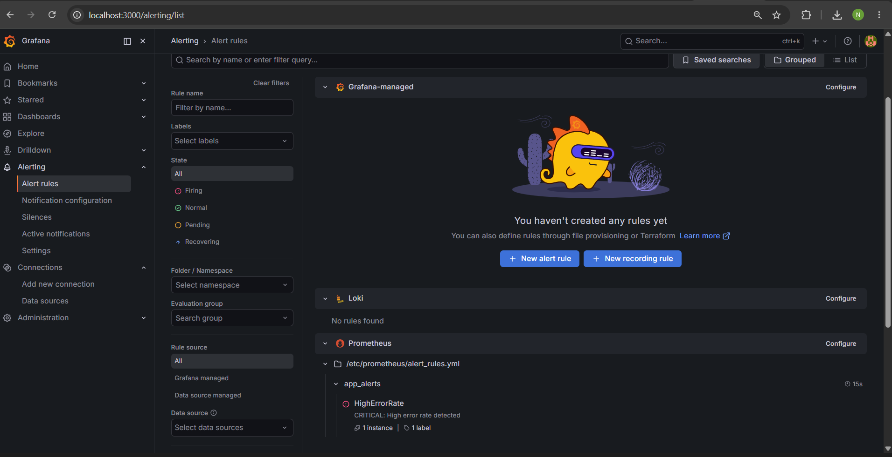
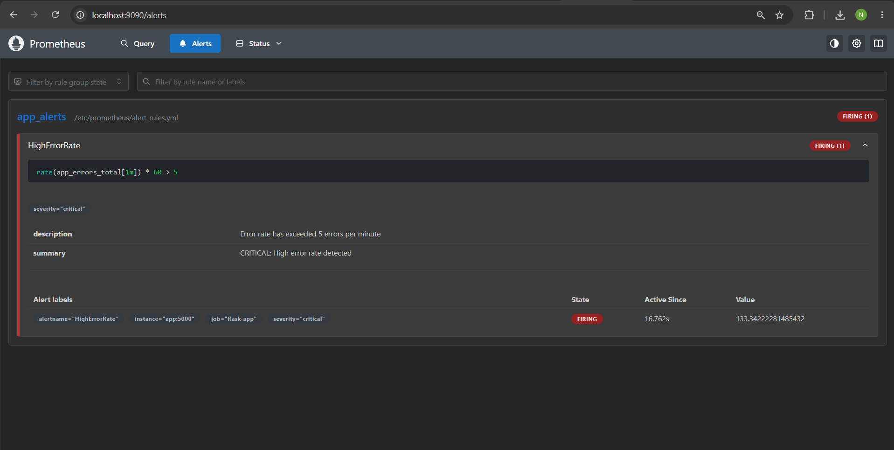

# DevOps Observability Lab
 
A complete observability system for a containerized Flask application, built with Prometheus, Grafana, Loki and Promtail. The entire stack runs with a single command using Docker Compose.
 
---

## Project Structure
 
```
.
├── app/
│   ├── app.py              # Flask app with Prometheus instrumentation and JSON logging
│   ├── Dockerfile
│   └── requirements.txt
├── prometheus/
│   ├── prometheus.yml      # Scrape config
│   └── alert_rules.yml     # HighErrorRate alert
├── loki/
│   └── loki-config.yml     # Local filesystem store, 7-day retention
├── promtail/
│   └── promtail-config.yml # Docker socket discovery, JSON pipeline
├── grafana/
│   └── provisioning/
│       ├── dashboards/     # App Metrics dashboard (auto-provisioned)
│       └── datasources/    # Prometheus + Loki (auto-provisioned)
└── docker-compose.yml
```


## Quick Start
 
```
docker compose up -d --build
```
 
| Service | URL |
|---|---|
| Flask App | http://localhost:5000 |
| Prometheus | http://localhost:9090 |
| Grafana | http://localhost:3000 |
| Loki | http://localhost:3100 |
 
Grafana login: `admin` / `admin` which will ask you to set new password OR you can just click `skip` button.
 
---
 
## Architecture Diagram
 
The diagram below shows how data flows from the application to the visualization layer.
 


**Metrics flow (pull model):** Every 15 seconds, Prometheus goes to the app's /metrics endpoint and collects the latest numbers (request count, error count). It saves them over time so that we can see how they change.

**Logs flow (push model):** Every time the app handles a request, it writes a log line in JSON format to the terminal. Docker saves that output. Promtail watches the container and picks up new log lines as they appear, then sends them to Loki for storage.

**Visualization:** Grafana connects to both Prometheus and Loki. It uses Prometheus data to draw metric charts and trigger alerts and Loki data to search and filter logs.

---
 
## Implementation Details
 
### Logging Strategy
 
The application writes structured JSON logs to stdout on every request. Each log line contains the following fields:
 
```json
{
  "timestamp": "2026-06-08T18:51:43",
  "level": "INFO",
  "method": "GET",
  "path": "/error",
  "status": 500,
  "duration_ms": 0
}
```
 
Docker automatically saves everything the app prints to the terminal. Promtail watches the container and picks up those log lines and then sends them to Loki. Before sending Promtail reads the JSON and pulls out useful fields like level, path and status and turns them into labels. Labels make it much faster to search and filter logs later in Grafana. 

### Custom Metrics
 
The app exposes two Prometheus counters at `/metrics`:
 
- `app_requests_total` - incremented on every request, labeled by method, path and status code
- `app_errors_total` - incremented only on 500 responses
### How to Trigger the CRITICAL Alert
 
The alert fires when the error rate exceeds 5 errors per minute. To simulate this, run the following command in PowerShell. It sends 100 requests to the `error` endpoint to trigger the HighErrorRate alert.:
 
```powershell
1..100 | ForEach-Object { Invoke-WebRequest -Uri http://localhost:5000/error -UseBasicParsing | Out-Null }
```
 
After running this, wait about 30-40 seconds and check the Prometheus Alerts page at `http://localhost:9090/alerts`. The `HighErrorRate` alert will show as **FIRING**. You can also see it in Grafana at `http://localhost:3000/alerting/list`.
 
---
 
## Evidence
 
### 1. Grafana Dashboard - Application Metrics
 
The dashboard shows real-time panels for total requests by path and status, error rate over time and a panel showing current errors per minute.
 

 
---
 
### 2. Loki Log Analysis - Filtered JSON Logs
 
The Explore view in Grafana queries Loki using LogQL. The query `{container="app"} |= "500"` filters logs to show only error requests, with the full JSON structure visible including timestamp, level, path and status.
 


Logs panel shows entries with "GET /error HTTP/1.1" 500 highlighted and JSON body below each entry.
 
---
 
### 3. Grafana Alerting - Active Alert Rule
 
The `HighErrorRate` alert rule is sourced directly from Prometheus (`.../prometheus/alert_rules.yml`) and is visible in Grafana's Alerting tab. The screenshot below shows the rule in **FIRING** state with `severity="critical"`.
 


You can also see active alert on  `http://localhost:9090/alerts`.



NOTE: The rate() function returns the average number of errors per second. Multiplying by 60 converts this value to errors per minute, so it can be directly compared with the value 5, which represents 5 errors per minute.

---
 
## Analysis
 
### 1. Why is JSON-structured logging more efficient than plain text logs?
 
In plain text logs important details like timestamps, log levels, HTTP methods or status codes are mixed into a single line of text. To extract these values we usually need regex patterns or custom parsing logic. This makes log processing more complicated because even a small change in the log format can break the parser.
With JSON logging every piece of information is stored as a separate key-value pair. This means log tools can automatically understand the structure without any extra setup. Systems like Loki can directly filter, search and group logs by fields such as level, status or path which is why JSON logs are easier to work with and less likely to cause errors. It is also much more efficient when we need to analyze large amounts of logs or build dashboards and alerts.

### 2. What is the fundamental technical difference between Prometheus and Loki?
 
Prometheus and Loki solve different problems and use fundamentally different data models.
 
**Prometheus** is a metrics system that works on a pull model and it actively scrapes targets at regular intervals and collects numbers. In this project Prometheus scrapes the /metrics endpoint on the Flask app every 15 seconds and reads two counters: app_requests_total and app_errors_total. It stores these as time-series numbers in its local time-series database which is optimized for math operations like rates and averages. Prometheus never sees any text, only numbers. 

**Loki** is a log aggregation system that uses a push model where log agents send logs to Loki instead of Loki actively collecting them. In this project the Flask application outputs JSON logs to standard output, Promtail reads these logs from the Docker container runtime and forwards them to Loki. Loki does not index the full content of log messages. It only indexes a small set of labels such as container name or log level and this makes it more cost-efficient to run.
When running a query like {container="app"} |= "500" in Grafana Explore, Loki returns the matching log lines directly. This allows us to see exactly which requests failed, when they failed and which endpoint was affected. 

So basically **Prometheus** is used to measure how often something happens and how big it is. It works with metrics over time such as request counts or error rates. This helps us see when something in the system becomes unusual.
**Loki**, on the other hand, is used to look at individual log events. It shows exactly what happened inside the system, including error messages and request details.

In this project they work together. Prometheus tells us that there is a problem, for example a high error rate and Loki helps us understand the reason by showing the actual logs behind those errors.

### 3. How would you handle long-term log retention (6 months) without depleting disk resources?
 
Storing 6 months of logs on a single server’s disk is not realistic because logs grow quickly and can easily fill up storage. A common solution is to use object storage such as AWS S3 or Google Cloud Storage instead of a local filesystem. This approach is cheaper, highly scalable and supported natively by Loki.

In this setup, Loki stores logs as compressed chunks in object storage. A component called the compactor is responsible for cleaning up old data and enforcing retention rules by removing logs that are older than the configured retention period. For example, setting retention_period: 4320h keeps logs for 6 months before they are deleted.

To reduce storage usage log filtering tools like Fluentd can also be used. Fluentd is used as a log processing layer between the application and the storage system. Instead of sending all logs directly to Loki, Fluentd collects them first and processes them before forwarding. It can filter out unnecessary logs such as health checks or debug messages which helps reduce the total amount of data being stored.