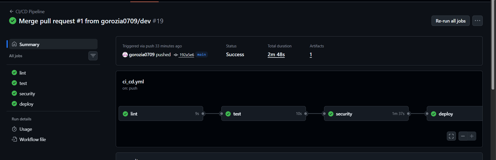

# DevOps Final Project

A production-ready DevOps project built on top of previously submitted assignments,
extending them with security automation, reliability improvements and a complete
CI/CD pipeline. The full stack runs locally with a single command using Docker Compose.

---

## Table of Contents

- [Project Architecture](#project-architecture)
- [Technology Stack](#technology-stack)
- [Environment Setup](#environment-setup)
- [Deployment Workflow](#deployment-workflow)
- [Security Implementation](#security-implementation)
- [Monitoring and Logging](#monitoring-and-logging)
- [Reliability Improvements](#reliability-improvements)
- [CI/CD Pipeline](#cicd-pipeline)
- [Screenshots](#screenshots)

---

## Project Architecture

The project consists of a Flask web application surrounded by a full observability
and deployment automation stack.

**Data flows:**
- Metrics: Prometheus scrapes `/metrics` on the Flask app every 15 seconds
- Logs: App writes JSON to stdout -> Docker captures -> Promtail ships to Loki
- Alerts: Prometheus evaluates alert rules -> fires when thresholds exceeded
- Deployment: Ansible manages blue-green slot switching with Docker containers

---

## Technology Stack

| Layer | Tool |
|---|---|
| Web framework | Python 3.11 + Flask |
| Containerization | Docker + Docker Compose |
| Metrics | Prometheus |
| Visualization | Grafana |
| Log aggregation | Loki + Promtail |
| CI/CD | GitHub Actions |
| IaC / Deployment | Ansible |
| Deployment strategy | Blue-Green |
| Dependency scanning | pip-audit |
| Container scanning | Trivy |
| Secrets scanning | Gitleaks |
| IaC validation | Checkov |
| Testing | pytest |
| Linting | flake8 |

---

## Environment Setup

### Prerequisites

- Docker Desktop installed and running
- Git

### Single command startup

```bash
bash setup.sh
```

On Windows use Docker Compose directly:

```
docker compose up -d --build
```

The `setup.sh` script automatically:
1. Checks Docker is installed
2. Creates `.env` from `.env.example` if it does not exist
3. Starts all services with Docker Compose
4. Runs health checks on each service

### Service URLs

| Service | URL | Credentials |
|---|---|---|
| Flask App | http://localhost:5000 | - |
| Prometheus | http://localhost:9090 | - |
| Grafana | http://localhost:3000 | admin / admin |
| Loki | http://localhost:3100 | - |

### Configuration

All configuration is done through environment variables. Copy `.env.example` to `.env`
and adjust values as needed:

```
cp .env.example .env
```

The `.env` file is gitignored and never committed. `.env.example` serves as the
template and documents all required variables.

---

## Deployment Workflow

### CI/CD Pipeline (GitHub Actions)

Every push triggers the automated pipeline:

lint -> test -> security -> deploy (smoke test, main branch only)

On pushes to `main`, after all checks pass, the deploy job:
1. Creates `.env` from `.env.example`
2. Builds and starts the full Docker stack
3. Waits for `/health` to return 200 (retries for 60 seconds)
4. Verifies `/metrics` endpoint responds
5. Verifies Prometheus is ready
6. Shows running containers
7. Tears down the stack

### Blue-Green Deployment (Ansible)

Actual deployment to a running environment is handled by Ansible.
The current active slot is tracked in `ansible/active_slot.yml`.

**Deploy to next slot:**

```
ansible-playbook -i ansible/inventory.ini ansible/deploy.yml
```

What happens:
1. Reads `active_slot.yml` to determine current slot (blue/green)
2. Builds a new Docker image for the target slot
3. Starts the target slot container
4. Health checks the target slot on its port
5. If healthy: switches `active_slot.yml`, stops old slot
6. If unhealthy: auto-rollback via `rescue:` block, old slot keeps running

**Rollback to previous slot:**

```
ansible-playbook -i ansible/inventory.ini ansible/rollback.yml
```

**Slot configuration:**

| Slot | Port |
|---|---|
| blue | 5000 |
| green | 5001 |

### Branch Strategy

| Branch | Purpose                                                   |
|---|-----------------------------------------------------------|
| `main` | Stable, production-ready. Protected - only merged via PR. |
| `dev` | All active development happens here.                      |

Workflow: develop on `dev` -> open PR -> CI checks pass -> merge to `main` ->
full pipeline including deploy smoke test runs.

---

## Security Implementation

All security checks are integrated into the CI/CD pipeline and run automatically
on every push.

### 1. Dependency Vulnerability Scanning - pip-audit

Scans `app/requirements.txt` for known CVEs in Python dependencies.

```
pip-audit -r app/requirements.txt
```

Runs in the `security` job on every push. Fails the pipeline if known
vulnerabilities are found.

### 2. Container Image Scanning - Trivy

Scans the built Docker image for OS and library vulnerabilities.

```yaml
- uses: aquasecurity/trivy-action@master
  with:
    image-ref: devops-final-app:latest
    severity: CRITICAL
    exit-code: '0'
```

Reports CRITICAL severity findings. Exit code 0 means it reports without
blocking - findings are visible in the Actions log.

### 3. Secrets Scanning - Gitleaks

Scans the repository for accidentally committed secrets, API keys or passwords.

```yaml
- uses: gitleaks/gitleaks-action@v2
  env:
    GITHUB_TOKEN: ${{ secrets.GITHUB_TOKEN }}
```

Runs on every push and pull request. Clean scan means no secrets detected
in the codebase or commit history.

### 4. IaC Security Validation - Checkov

Validates `docker-compose.yml` for security misconfigurations.

```
checkov -f docker-compose.yml --quiet
```

Checks for issues like containers running as root, missing resource limits
and insecure configurations.

### 5. Secrets Management

- `.env` is gitignored - never committed to the repository
- `.env.example` is committed - documents required variables with safe placeholders
- `docker-compose.yml` reads secrets from environment variables, not hardcoded values
- GitHub Actions secrets (`GITHUB_TOKEN`) used for Gitleaks authentication

---

## Monitoring and Logging

### Metrics

The Flask app exposes two Prometheus counters at `/metrics`:

- `app_requests_total` - every request, labeled by method, path and status code
- `app_errors_total` - incremented only on 500 responses

Prometheus scrapes `/metrics` every 15 seconds and stores the data as time series.

### Logging

The app writes structured JSON logs to stdout on every request:

```json
{
  "timestamp": "2026-07-01T12:00:00",
  "level": "INFO",
  "method": "GET",
  "path": "/health",
  "status": 200,
  "duration_ms": 0
}
```

Docker captures stdout -> Promtail reads container logs via Docker socket ->
Promtail extracts labels (level, path, status) -> ships to Loki.

**Querying logs in Grafana:**
1. Open http://localhost:3000
2. Go to Explore -> select Loki datasource
3. Run: `{container="app"} |= "500"` to see all error requests

### Grafana Dashboard

Auto-provisioned dashboard at http://localhost:3000 shows:
- Total requests rate by method, path, and status
- Error rate over time
- Error rate per minute (stat panel)
- App availability (up/down)

### Alerting

Two alert rules defined in `prometheus/alert_rules.yml`:

**HighErrorRate** - fires when error rate exceeds 5 per minute:
```yaml
expr: rate(app_errors_total[1m]) * 60 > 5
```

**AppDown** - fires when the app is unreachable for more than 1 minute:
```yaml
expr: up{job="flask-app"} == 0
for: 1m
```

**To trigger HighErrorRate alert (for testing):**

```
1..100 | ForEach-Object {
  Invoke-WebRequest -Uri http://localhost:5000/error -UseBasicParsing | Out-Null
}
```

Wait 30 seconds and check http://localhost:9090/alerts.

---

## Reliability Improvements

### Health Checks

The app exposes `/health` returning `{"status": "ok", "slot": "<slot>"}`.
Used by:
- Ansible deploy/rollback playbooks before switching slots
- CI pipeline deploy job verification
- Automated health check script (cron-based)

### Automated Health Check Script

`ansible/roles/monitor/files/health_check.py` runs every 5 minutes via cron
(scheduled by Ansible). If the app is unreachable it automatically runs
`docker compose restart app` and logs the event.

Run manually:

```
python ansible/roles/monitor/files/health_check.py
```

### Rollback Procedure

See `docs/RUNBOOK.md` for full incident response steps.

Quick reference:

```
# Ansible rollback (switches to previous slot)
ansible-playbook -i ansible/inventory.ini ansible/rollback.yml

# Full stack restart
docker compose down && docker compose up -d --build
```

### Auto-Rollback on Failed Deploy

The Ansible `deploy.yml` uses a `block/rescue` pattern. If the health check
fails after starting the new slot, the `rescue:` block automatically:
1. Stops the failed new slot container
2. Reverts `active_slot.yml` to the previous slot
3. Fails with a clear message - old slot was never stopped so it keeps running

### Service Level Objective

**99% of HTTP requests over any 5-minute window must return a non-5xx response.**

Measured using `app_requests_total` and `app_errors_total` Prometheus counters.
The `HighErrorRate` alert serves as the SLO burn-rate signal.

---

## CI/CD Pipeline

Full pipeline on push to `main`:


- `lint` and `test` run on all branches and PRs
- `security` runs after tests pass
- `deploy` runs only on push to `main` after security passes

---

## Screenshots

### 1. GitHub Actions - Full Pipeline Green



### 2. GitHub Actions - Security Job Detail

*Click on the security job → expand each step → screenshot showing
pip-audit output, Trivy scan results, Gitleaks clean scan, Checkov passing.*

### 3. GitHub Actions - Deploy Job Detail

*Click on the deploy job → screenshot showing "App is healthy." output
from the health check loop and the running containers list.*

### 4. Grafana Dashboard

*Open http://localhost:3000 → App Metrics dashboard →
screenshot showing the four panels with live data.*

### 5. Prometheus Alerts — HighErrorRate Firing

*Run the PowerShell error loop above, wait 30 seconds →
screenshot of http://localhost:9090/alerts showing HighErrorRate in FIRING state.*

### 6. Grafana — Loki Log Query

*Open http://localhost:3000 → Explore → Loki →
run query `{container="app"} |= "500"` →
screenshot showing filtered error logs with JSON structure visible.*

### 7. Ansible Blue-Green Deployment

*Run `ansible-playbook -i ansible/inventory.ini ansible/deploy.yml` in WSL →
screenshot of terminal showing the full playbook output including
"Switch complete. Active slot is now green/blue".*

### 8. Ansible Rollback

*Run `ansible-playbook -i ansible/inventory.ini ansible/rollback.yml` →
screenshot of terminal showing "Rollback complete" output.*

### 9. Prometheus Targets — App UP

*Screenshot of http://localhost:9090/targets showing flask-app as UP.*

### 10. AppDown Alert Firing

*Run `docker compose stop app` → wait 60 seconds →
screenshot of http://localhost:9090/alerts showing AppDown in FIRING state →
then run `docker compose start app` to recover.*